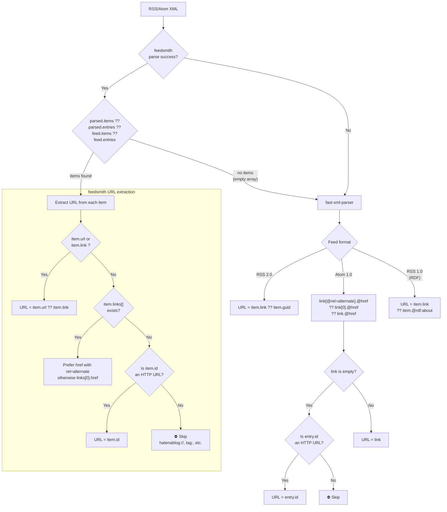
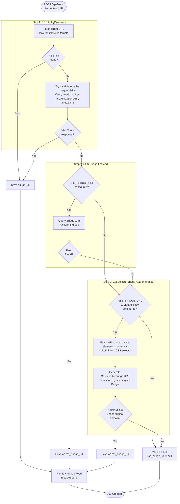
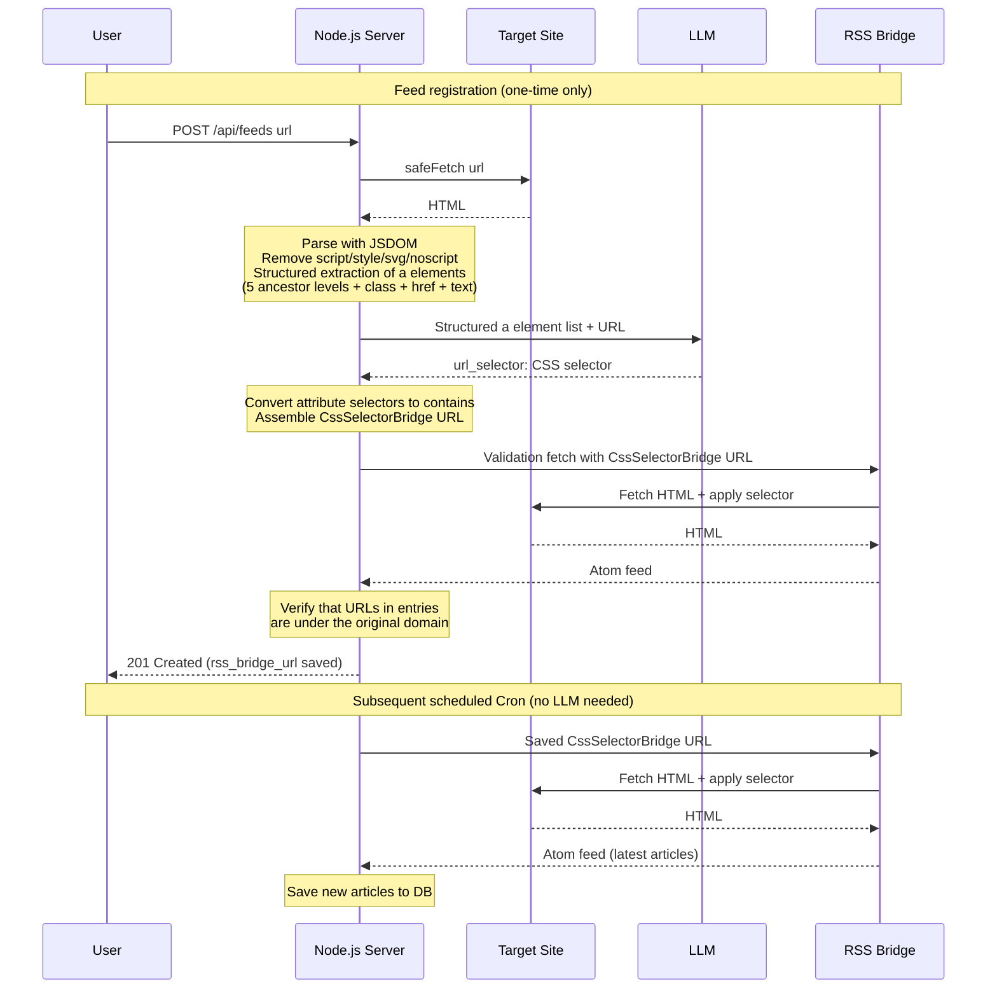

# Oksskolten Spec — Article Ingestion Pipeline

> [Back to Overview](./01_overview.md)

## Article Ingestion Pipeline

### Design Philosophy: Full-Text Retrieval Beyond RSS Feeds

Typical RSS readers (FreshRSS, CommaFeed, etc.) display RSS feed XML content (`content:encoded`, `description`) as-is. Since many feeds provide only a title and a few lines of summary, reading the full text requires navigating to the original site.

Oksskolten **fetches HTML directly from the original URL for every article** and extracts the full text using Readability. This provides:

- **Self-contained reading experience**: No need to navigate to the original site to read articles
- **Higher quality AI processing**: Summaries and translations are based on the complete article body, not RSS fragments
- **Better full-text search accuracy**: Meilisearch indexes the complete article body

> Only Miniflux optionally has a Readability-based Crawler feature, but it requires manual per-feed activation. Oksskolten performs full-text retrieval by default for all articles.

### Cron Processing Flow

Cron runs at 5-minute intervals (`*/5 * * * *`) and processes only feeds whose `next_check_at` has passed.

**Scheduler requirements.** A cron expression without a seconds field matches a window exactly one second wide, so the scheduler has to sample that second reliably. node-cron 3 did not: it polled by chaining `setTimeout(check, 1000)`, giving a period of 1000ms *plus* the check and any event-loop lag, with no re-alignment to the wall clock. On the live server that drifted about +0.32s per 5-minute tick, and each time the drift crossed a second boundary the firing was skipped outright — roughly 5-9% of feed sweeps never ran. Its `recoverMissedExecutions` option is not a fix: the one-second lookback re-examines the second that just fired and the guard compares against a millisecond-truncated `lastExecution`, so enabling it makes *every* slot fire twice about a second apart.

node-cron 4 replaced the polling scheduler with one that computes the next boundary from the wall clock; measured firing offsets hold at +0.006–0.015s with no drift and no double firing, and it logs a warning when blocking work does cost a tick. All cron registrations pass `noOverlap: true`, which skips a firing while the previous one is still running — relevant for the feed sweep, which fans out over every feed and has been measured at up to 36 seconds. This is distinct from `activeFetchPromise`, which exists so shutdown can wait for an in-flight sweep before closing the database.

```
1. SELECT * FROM feeds WHERE disabled = 0 AND type = 'rss'
     AND (next_check_at IS NULL OR next_check_at <= strftime('%Y-%m-%dT%H:%M:%SZ', 'now'))
   <- Feeds with next_check_at = NULL (initial/unset) are fetched immediately
2. Fetch each feed's RSS URL (parallel with semaphore, max 5 concurrent)
   - Prefer rss_url
   - Use rss_bridge_url only if rss_url is NULL
   - Skip if both are NULL (record "No RSS URL" in last_error)
   -- Bandwidth Optimization (2-stage early return) --
   2a. Conditional HTTP request (1st line of defense):
       - Send feeds.etag as If-None-Match, feeds.last_modified as If-Modified-Since headers
       - If the server returns 304 Not Modified, skip the XML download entirely
   2b. Content hash comparison (2nd line of defense, for servers that don't support ETag):
       - Compute SHA-256 of the response body and compare with feeds.last_content_hash
       - If matched, skip XML parsing (early return as notModified)
   2c. On success, update feeds.etag / feeds.last_modified / feeds.last_content_hash
   -- Adaptive Scheduling --
   2e. Determine next check interval from 3 signals:
       - HTTP Cache-Control: max-age / Expires headers
       - RSS <ttl> element (minutes converted to seconds)
       - Empirical (CommaFeed method: step-down based on article update frequency)
         No updates for 30+ days -> 4h / 14-30 days -> 2h / 7-14 days -> 1h / <7 days -> half the average article interval
       - Take the maximum of the 3 signals, clamped to 15min-4hours
       - Save feeds.next_check_at = now + interval, feeds.check_interval = interval
       - On notModified, reuse the previous check_interval (interval is never shortened)
   -- Parsing --
   2d. Parse RSS/Atom with feedsmith -> fast-xml-parser fallback chain
       (Supports RSS 2.0 / Atom 1.0 / RSS 1.0 (RDF))
       See "RSS Parsing and URL Extraction Flow" below for parsing and URL extraction details
   2f. Remove URL tracking parameters (Miniflux method)
       - After parsing and before duplicate checking, strip 60+ tracking parameters from all article URLs
       - Targets: utm_*, mtm_*, fbclid, gclid, msclkid, twclid, mc_cid, _hsenc, etc.
       - Prevents duplicate insertion when the same article is served with different tracking parameters
   2g. Normalize URLs (`normalizeUrl`, i.e. `new URL().href`)
       - Applied on write in insertArticle, so the stored URL is canonical
       - Also collapses raw-Unicode vs percent-encoded paths, bare origins vs
         trailing slash, host casing, and default ports
       - See docs/adr/003-normalized-article-urls.md
3. SELECT each article URL -> add those not in articles to the new article list (max 30 per feed)
   - getExistingArticleUrls returns a set keyed by the caller's URL strings, so
     the fetcher can filter on the raw feed URL directly
4. Retrieve existing articles eligible for retry:
   SELECT * FROM articles
   WHERE last_error IS NOT NULL
     AND (full_text IS NULL OR summary IS NULL
          OR (lang != 'ja' AND full_text_ja IS NULL))
5. Process new + retry candidates in parallel with semaphore (max 5 concurrent):
   a. If full_text is NULL -> HTML cleaning + Readability + Turndown for full-text retrieval
      - pre-clean -> Readability -> post-clean -> Markdown conversion (see pipeline details below)
      - Extract OGP image (og_image)
      - Generate 200-character preview (excerpt) — markdown syntax (images, links) stripped to plain text
   b. If lang is NULL -> Local language detection via CJK character ratio (no API required)
   c. New articles: INSERT INTO articles / Retry: UPDATE articles
   d. New articles: fire-and-forget async similarity detection (see [83_feature_similarity.md](./83_feature_similarity.md))
   e. On successful processing: clear last_error = NULL
6. Per feed: on fetch success, reset error_count=0, last_error=NULL
7. Per feed: on fetch failure, error_count++, record in last_error
8. Feeds with error_count >= 5 are updated to disabled = 1
9. Remaining work continues in the next Cron cycle
```

### RSS Parsing and URL Extraction Flow

Fallback chain from feedsmith to fast-xml-parser, and the flow for safely extracting URLs from each item. Filters out internal URIs like `hatenablog://` or `tag:` that may appear in Atom `<id>`.



**Note**: Summarization (Haiku) and translation (Sonnet) are not executed during Cron. They are invoked on-demand when the user opens an article (`POST /api/articles/:id/summarize`, `POST /api/articles/:id/translate`).

### Shared Article Fetch Function (`fetchArticleContent`)

The fetch + fallback + language detection logic is encapsulated in a single exported function `fetchArticleContent()` in `server/fetcher.ts`. Both the Cron pipeline (`processArticle`) and the clip save endpoint (`POST /api/articles/from-url`) call this function, ensuring identical behavior for full-text retrieval, FlareSolverr fallback, bot-block detection, and language detection. See [Clip spec](./80_feature_clip.md#shared-fetch-pipeline-with-rss-feeds) for the option differences between RSS and clip invocations.

**RSS Content Fallback**: When page-level extraction fails or returns insufficient content, `fetchArticleContent` falls back to the RSS feed's inline content (`<description>` / `<content:encoded>`). The fallback triggers when any of the following conditions are met:

1. `fullText` is `null` (fetch completely failed)
2. `fullText` matches bot-block patterns (e.g., "checking your browser", "unusual traffic from your computer network", "Before you continue to YouTube") — see `isBotBlockPage` in `server/lib/blocked-body.ts`
3. `fullText` is shorter than `MIN_EXTRACTED_LENGTH` (200 chars)

When the fallback triggers, the RSS content is only used if it is more substantial (by character count) than whatever was extracted from the page. RSS HTML content is converted to Markdown via `convertHtmlToMarkdown()` in `server/fetcher/markdown-utils.ts`, which auto-detects HTML vs plain text/Markdown and only applies Turndown for HTML input.

This addresses SPA sites where even FlareSolverr returns rendered HTML but `preClean` removes `display: none` elements, leaving Readability with an effectively empty DOM — while the RSS feed itself often contains the full article content (as used by readers like Feedly).

**Retries get the same fallback.** `listingExcerpt` used to be supplied only for new articles, so an article that failed its first attempt could never be rescued by RSS content no matter how many times it was retried — even when its feed carried a perfectly good description the whole time. `fetchAllFeeds` now builds a normalized-URL → excerpt map from every feed pulled in the sweep (`FeedFetchOutcome.excerptsByUrl`, covering all items, not just new ones) and attaches the matching excerpt to each retry task. Feeds that answered 304, errored, or were not due contribute nothing, so those retries behave exactly as before.

This matters because the other repair path, `refreshStaleArticles`, is on a 24-hour backoff per article (`last_refresh_attempt_at`): an article whose feed had no description at the moment of its one refresh attempt stays empty for a full day, while the retry queue burns its per-run budget on it every 5 minutes. Feeding the excerpt to retries closes that gap at the retry cadence instead of the refresh cadence, and clears `last_error` as a normal successful fetch would — `refreshStaleArticles` fills the body but deliberately leaves the error alone.

### YouTube Videos (`server/fetcher/youtube.ts`)

A YouTube watch page is never scraped. It has no prose to extract — the player is JavaScript — and from a server IP YouTube usually answers with its "unusual traffic" interstitial, which Readability extracts as if it were the article. `fetchArticleContent` therefore routes any URL that `parseYouTubeVideoId()` recognises (`/watch?v=`, `youtu.be/`, `/shorts/`, `/embed/`, `/live/`, `/v/`) to `fetchYouTubeContent()` instead, and deliberately does **not** fall through to `fetchFullText` — scraping is what produced the block pages in the first place.

The body is built from what a video actually contains in text form:

| Source | Endpoint | Provides |
|---|---|---|
| InnerTube player | `POST /youtubei/v1/player` | `shortDescription`, caption track list, title, thumbnails |
| Timed text | The track's signed `baseUrl` + `fmt=json3` | The transcript (legacy `<transcript>` XML is parsed too) |
| oEmbed | `GET /oembed` | Title / channel / thumbnail — not bot-gated, so it backfills a refused player call |

Stored `full_text` is Markdown with up to two sections:

```markdown
## Description

<the description box, verbatim>

## Transcript (en, auto-generated)

[0:00] Caption lines grouped into ~600-character paragraphs …

[1:23] … each prefixed with the timestamp it starts at
```

Behavior notes:

- **Client fallback**: InnerTube is tried with the `ANDROID` client, then `WEB`. YouTube refuses these unevenly by IP reputation and which one works shifts over time, so a refusal (`!res.ok`, or a `playabilityStatus` other than `OK`) moves to the next client rather than aborting.
- **Caption choice** (`pickCaptionTrack`): preferred languages are tried **in order** — the user's `general.language`, then `en` — and within each, a human-written track beats an automatic (`kind: 'asr'`) one. If no preference matches, any human-written track is used, then any track at all: captions in the wrong language still beat no body.
- **Transcript cap**: `MAX_TRANSCRIPT_CHARS` (60,000) — multi-hour streams would otherwise dominate a batch summarize call. Truncation appends `… (transcript truncated)`.
- **Degradation**: no captions still yields the description. When neither can be retrieved, `fullText` stays `null` — an honest empty body rather than a summary of an interstitial.
- **The player call is the discriminator**: `fetchYouTubeContent` returns `null` when `fetchPlayerMetadata` fails, *regardless of oEmbed*. oEmbed answers `200` with a title and thumbnail for every public video but carries no description field, so it can establish that a video exists and never that it has no text. Treating a refused player as "no text" would permanently write off videos that do have descriptions and captions.
- **No text is a result, not an error**: when the player *succeeds* and reports an empty description box with no caption tracks, the fetch is recorded as *completed* — `full_text` `NULL`, `last_error` `NULL` — keeping the returned title and thumbnail. Retrying cannot conjure captions that do not exist, so flagging it would park the article in the full-text retry queue forever and consume the per-run `RETRY_BATCH_LIMIT` budget ahead of articles a retry could actually repair. The reader renders the embedded player over an empty body. A refused player instead records `last_error = "youtube: could not retrieve video metadata"` and stays retryable.
- **Repairing existing articles**: migration `0012_youtube_reset_block_pages.sql` clears the body — and the summary / translation derived from it — of any YouTube article whose stored `full_text` matches an interstitial, sets `last_error`, and resets `retry_count`, which puts it back in the retry queue so the captions pipeline rebuilds it. Bodies that are not positively identified as block pages are left alone. Migration `0013_youtube_correct_no_text_reason.sql` then rewrites the retired `"youtube: no captions or description available"` message — which conflated the two cases above and in practice almost always meant a refused player — to the accurate `"youtube: could not retrieve video metadata"`. It deliberately does not reset `retry_count`, since those articles still fail for the original reason; requeue them once player access is restored.
- **Feed-level fallback**: YouTube's channel feed carries no `<content>` or `<summary>`; the description box lives in `<media:group><media:description>`. `parseRssXml` extracts it as the item excerpt (both the feedsmith and fast-xml-parser paths), so the standard RSS content fallback still leaves a body when the video APIs are refused entirely.

### Full-Text Retrieval and Markdown Conversion Pipeline

End-to-end flow from article URL to Markdown text. A multi-stage pipeline combining HTML cleaning (defuddle-based) and Readability that removes noise such as ads, navigation, and tracking attributes before converting to Markdown. Runs entirely locally with no external API dependencies.

**Worker Thread Isolation**: DOM parsing (jsdom + Readability + Turndown) is a CPU-intensive synchronous operation that blocks the main thread's event loop. To prevent this, it runs in a Worker Thread pool via piscina (maxThreads: 2). HTTP fetching (async I/O) remains on the main thread, with only DOM parsing delegated to Workers.

```
Main Thread (Event Loop)                Worker Thread (piscina, max 2)
├─ Fastify API <- unaffected            ├─ jsdom DOM construction
├─ cron -> fetchAllFeeds                ├─ Readability article extraction
│   ├─ HTTP fetch (async I/O)          ├─ preClean / postClean
│   └─ pool.run(html) ──────────→      └─ Turndown -> Markdown
└─ health check <- unaffected
```

**Implementation files**: `server/fetcher/content.ts` (HTTP fetching + pool invocation), `server/fetcher/contentWorker.ts` (DOM parsing logic), `server/fetcher/markdown-utils.ts` (HTML→Markdown conversion + excerpt generation), `server/lib/cleaner/`

**Opting out per feed**: when a feed has `skip_full_text_fetch = 1`, `fetchArticleContent` never calls `fetchFullText` and the whole pipeline below is bypassed. The RSS content (`content:encoded` / `description`) is converted to Markdown and stored as `full_text`, the first `` in it becomes `og_image`, and an item with no content is stored with an empty body and no `last_error`. This exists for sources that gate scrapers hard enough that fetching is pure cost — Reddit and X return either a block page or a JS-only shell, and the FlareSolverr quality-gate retry (step 8) then burns a browser render per article to reach the same dead end. Such articles are also excluded from the retry queue (`getRetryArticles`).

```
fetchFullText(articleUrl, cleanerConfig?)
│
├─ 1. HTML retrieval [Main Thread]
│     requires_js_challenge=1 -> retrieve via FlareSolverr
│     Otherwise -> safeFetch(url), fallback to FlareSolverr on 403
│
├─ 2-6. Delegate to Worker Thread via pool.run() [Worker Thread]
│
├─ 2. Phase 1: pre-clean (safe removal before Readability)
│     preClean(doc, cleanerConfig)
│     ├─ Remove script, style, noscript, [hidden], [aria-hidden="true"], etc.
│     └─ Delete elements that are definitely noise using ~20 safe CSS selectors
│     * Fail-open: on exception, continue with original HTML
│
├─ 3. Phase 2: Readability body extraction
│     new Readability(doc).parse() -> article.content (HTML)
│     ├─ Automatically excludes sidebars, navigation, footers (same algorithm as Firefox Reader View)
│     └─ Validate Readability result with content block scoring:
│        findBestContentBlock(doc) analyzes paragraph density + link density + class/id indicators
│        Replace if a block has 2x or more text than the Readability result
│
├─ 4. Phase 3: post-clean (noise removal after extraction + normalization)
│     postClean(doc, cleanerConfig)
│     │
│     ├─ Step 1: Selector-based removal
│     │   ├─ Exact match CSS selectors (~100): nav, .sidebar, .ad-container, etc.
│     │   └─ Partial match patterns (~400): substring matching against class/id/data-* attributes
│     │      "social", "share", "comment", "related", etc.
│     │
│     ├─ Step 2: Score-based removal (CJK-aware)
│     │   Identify and remove non-content blocks using character-count-based thresholds
│     │   ├─ Content protection: role="article", class containing "content", etc. -> do not remove
│     │   │   Thresholds: 140 chars + 2 paragraphs, 400 chars standalone, 80 chars + 1 paragraph
│     │   ├─ Navigation indicator text detection: "read more", "subscribe", etc. -> penalize
│     │   ├─ Link density: link text ratio > 50% -> penalize
│     │   └─ class/id patterns: "nav", "sidebar", "footer", etc. -> penalize
│     │   * All use character count (not word count) for CJK language support
│     │
│     └─ Step 3: HTML normalization
│         ├─ standardizeSpaces: \xA0 (nbsp) -> normal space (skip pre/code)
│         ├─ removeHtmlComments: remove all Comment nodes
│         ├─ flattenWrapperElements: unwrap wrapper divs (2 passes)
│         │   ├─ div with single child element -> replace with child
│         │   └─ div with only block children -> unwrap children into parent
│         ├─ stripUnwantedAttributes: remove attributes not on whitelist
│         │   Allowed: href, src, alt, title, width, height, colspan, rowspan, etc.
│         │   SVG elements are protected (attributes not removed)
│         ├─ removeEmptyElements: recursively remove empty elements (preserve br/hr/img, etc.)
│         └─ stripExtraBrElements: limit consecutive <br> to max 2
│     * Fail-open: on exception, continue with Readability output
│
├─ 5. <picture> simplification
│     <picture> -> convert to simple  (avoid srcset issues)
│     Resolve relative URLs to absolute URLs
│
├─ 6. Turndown: HTML -> Markdown conversion
│     headingStyle: 'atx', codeBlockStyle: 'fenced'
│     Table-related tags are kept as HTML
│
├─ 7. Excerpt generation
│     Extract first 200 characters from Markdown text
│     Uses markdownToExcerpt(): strips images and link syntax, then truncates
│
└─ 8. FlareSolverr automatic retry (quality gate) [Main Thread]
      If requires_js_challenge was NOT set and the extracted text is
      under MIN_EXTRACTED_LENGTH (200 chars) or classified as garbage:
      ├─ Garbage detection (isGarbageExtraction): bot-block patterns
      │   (server/lib/blocked-body.ts),
      │   fewer than 3 prose sentences, or prose ratio < 10% of total text
      ├─ Fetch via FlareSolverr with waitForSelector targeting content containers
      │   (article, main, [role="main"], .post-content, .entry-content)
      ├─ Re-run the full pipeline (stripHeavyTags -> Worker parse) on FlareSolverr HTML
      └─ Adopt FlareSolverr result only if it yields more text than the original
      * Independent of the per-feed requires_js_challenge flag —
        an automatic quality gate that retries with JS rendering when
        static fetch produces poor results
```

**Fail-open design**: pre-clean/post-clean are wrapped in try-catch, and on exception, the original HTML/Readability result is used as-is. This guarantees that cleaner failures never block article ingestion.

**CleanerConfig**: Cleaning behavior can be customized per feed (additional selectors, scoring threshold adjustments, enabling/disabling normalization, etc.).

**Directory structure**:

```
server/lib/cleaner/
  index.ts              <- preClean() / postClean() entry point
  selectors.ts          <- All constants + CleanerConfig + buildPipelineConfig()
  selector-remover.ts   <- removeBySelectors() pure function
  content-scorer.ts     <- CJK-aware scoring + findBestContentBlock()
  html-normalizer.ts    <- HTML structure normalization (6 functions)
```

### Language Detection (Local Processing)

```typescript
function detectLanguage(fullText: string): string {
  const sample = fullText.slice(0, 1000)
  const jaCount = (sample.match(/[\u3040-\u309F\u30A0-\u30FF\u4E00-\u9FFF]/g) || []).length
  return jaCount / sample.length > 0.1 ? 'ja' : 'en'
}
```

If the ratio of CJK characters (hiragana, katakana, kanji) in the first 1000 characters exceeds 10%, the language is `ja`; otherwise `en`. No API calls required, zero cost.

### AI API Calls (On-Demand)

All AI calls go through OpenRouter, which fronts models from every major vendor behind one OpenAI-compatible API and one API key. Streaming is supported. The model is configured independently for summarization and translation (`summary.model`, `translate.model`) as an OpenRouter model id such as `deepseek/deepseek-v4-flash`. There is no default: a task with no model configured fails with `MODEL_NOT_SET` rather than silently spending on a model the user did not pick.

The max output tokens for each task can also be overridden (`summary.max_tokens`, default 2048; `translate.max_tokens`, default 16384). This matters for models whose context window is smaller than the defaults: a request whose completion cap exceeds the model's capacity fails outright, so lowering the cap makes summarization and translation usable on such models. Unset values fall back to the defaults.

**Reasoning**

Summarizing and translating are throughput tasks, so reasoning is off by default: requests carry `reasoning: { enabled: false }` unless `summary.reasoning` / `translate.reasoning` is `on`. This matters because several models — DeepSeek V4 among them — think by default, and their reasoning tokens are billed against `max_completion_tokens` while producing no visible output. Left enabled, a summary that should take seconds stalls for a minute and can be truncated by a budget the thinking already spent.

When reasoning is on, the token default rises to 8192 (summary) / 24576 (translate) to leave the answer room alongside the thinking. An explicit `*.max_tokens` still wins over both defaults.

Requests also carry `provider: { sort: "throughput" }`, which keeps OpenRouter off the slowest host serving a given model. The OpenAI client is configured with a 5 minute timeout and a single retry, replacing SDK defaults under which a stalled generation could occupy half an hour before surfacing an error.

Reasoning tokens arrive on a `delta.reasoning` field outside the OpenAI schema. They are streamed to the client as SSE `{ type: "reasoning" }` events — separate from the `delta` events carrying the answer — so a thinking model shows live progress instead of appearing frozen. Reasoning text is never mixed into the stored summary or translation.

**Summarization**

```typescript
// Model: `summary.model` setting (OpenRouter model id)

// Prompt summary:
// - Line 1: Concisely summarize the overall point of the article in 1-2 sentences
// - Line 3+: List key points as bullet points (3-4 ideal, max 7)
// - Each item in the format "**Key point title** — supplementary explanation"
// - Output in Markdown (bullet points start with "- ")
```

Results are saved in `articles.summary` (Markdown format).

**Translation**

```typescript
// Model: `translate.model` setting (OpenRouter model id)

// Prompt summary:
// - Literal translation without omitting a single word
// - 1:1 with the original text volume
// - Preserve Markdown formatting
```

Results are saved in `articles.full_text_ja`. The entire full_text is passed as-is (not truncated).

Processing flow:
1. User opens an article and selects the "Summary" tab -> invokes summarization via `POST /api/articles/:id/summarize`
2. User selects the "Japanese" tab -> invokes translation via `POST /api/articles/:id/translate`
3. Japanese articles only get summarized, no translation call (minimal cost)
4. Results are cached in the DB; no API calls from the second access onward

### published_at Normalization

```typescript
function normalizeDate(pubDate: string | undefined): string | null {
  if (!pubDate) return null
  const d = new Date(pubDate)
  return isNaN(d.getTime()) ? null : d.toISOString()
}
```

### Parallel Processing

```typescript
// Semaphore: Promise-based concurrency control
class Semaphore {
  private queue: (() => void)[] = []
  private active = 0
  constructor(private max: number) {}
  async run<T>(fn: () => Promise<T>): Promise<T> {
    if (this.active >= this.max) {
      await new Promise<void>(resolve => this.queue.push(resolve))
    }
    this.active++
    try { return await fn() }
    finally {
      this.active--
      this.queue.shift()?.()
    }
  }
}

const CONCURRENCY = 5
```

### Progress Events (EventEmitter)

Feed fetching progress is broadcast via `EventEmitter` and delivered to clients through an SSE endpoint. Supports late connections (current state is retained in the `feedState` map and replayed).

```typescript
type FetchProgressEvent =
  | { type: 'feed-articles-found'; feed_id: number; total: number }
  | { type: 'article-done'; feed_id: number; fetched: number; total: number }
  | { type: 'feed-complete'; feed_id: number }
```

### RSS Auto-Discovery (On Feed Registration)

Resolves the RSS URL through a 3-stage fallback chain.



#### Step 1 Details

1. Fetch the blog URL and look for `<link rel="alternate" type="application/rss+xml">` or `<link rel="alternate" type="application/atom+xml">`. Also retrieve `<title>`
2. If not found, try candidate paths sequentially with HEAD requests: `/feed`, `/feed.xml`, `/rss`, `/rss.xml`, `/atom.xml`, `/index.xml`. If HEAD fails (405, etc.), fall back to GET (5-second timeout)
3. If Content-Type is XML/Atom, save as `rss_url`
4. If an RSS URL is found, fetch the feed itself to retrieve the feed title


### CssSelectorBridge Auto-Inference (Step 3 Details)

For sites where both RSS auto-discovery and RSS Bridge findfeed fail (e.g., claude.com/blog), the LLM infers CSS selectors for article links from the page HTML and automatically generates an RSS Bridge CssSelectorBridge URL.

When Step 1 discovers a global RSS feed, the user is presented with a choice: **"Subscribe to the whole site"** (uses the discovered RSS) or **"Subscribe to this page only"** (bypasses Steps 1–2 and runs LLM inference). This is useful when a site has a global RSS feed but no per-category or per-page feed (e.g., subscribing to a specific artist page on a music news site).

**Activation conditions**: `RSS_BRIDGE_URL` environment variable is set, and at least one LLM provider API key is configured

**Implementation file**: `server/rss-bridge.ts`

#### Component Roles

| Component | Role | Invocation Timing |
|---|---|---|
| Node.js (`inferCssSelectorBridge`) | Fetch page HTML, structured extraction of `<a>` elements, LLM invocation, Bridge URL generation and validation | Feed registration only (once) |
| LLM | Infer CSS selector for article links from `<a>` element list | Feed registration only (once) |
| RSS Bridge (CssSelectorBridge) | Generate Atom feed from page HTML using the specified CSS selector | Every scheduled Cron run (ongoing) |

#### Processing Flow



#### LLM Prompt Design

The LLM is instructed to:
- Explicitly state that the `<a>` element text will become the RSS feed title
- Select `<a>` elements containing actual article titles, not generic text like "Read more" or category names
- When multiple `<a>` elements point to the same URL, use ancestor classes to distinguish title links
- Use `*=` (contains) for `href` attribute selectors (`^=` is not allowed because CssSelectorBridge converts relative URLs to absolute URLs)

#### Maintenance Characteristics

- **The LLM is called only once at registration time**. Afterward, RSS Bridge directly fetches pages using the saved CssSelectorBridge URL
- **As long as the DOM structure doesn't change**, new articles continue to be automatically fetched
- If a site redesign invalidates the selector, delete and re-register the feed for the LLM to infer a new selector
- JS-only rendered sites are not supported (RSS Bridge's PHP fetcher cannot execute JavaScript)
- LLM cost: Input is a few KB of text, output is a single JSON line. Less than $0.001 per call with Haiku

### Error Handling

| Level | Error | Response |
|---|---|---|
| Feed | Fetch failure | Skip, record in `last_error`, `error_count++` |
| Feed | `error_count` < 3 | Normal retry (retry in next Cron cycle) |
| Feed | `error_count` >= 3 | Exponential backoff: `next_check_at = now + 1h * (error_count - 2)`, max 4 hours. Feed is not disabled |
| Feed | Rate limit (429/503) | Set `next_check_at` per `Retry-After` header (default 1 hour). `error_count` is not incremented |
| Feed | Fetch success | Reset `error_count = 0`, `last_error = NULL`. Update `etag` / `last_modified` / `last_content_hash`. Set `next_check_at` / `check_interval` with adaptive interval |
| Article | Full-text retrieval failure (fetch failure / Readability extraction failure) | `full_text = NULL`, record in `last_error`. Retry in next Cron cycle |
| Article | Claude API failure (summarization / translation) | `summary = NULL` or `full_text_ja = NULL`, record in `last_error`. Retry when user requests again |

SQLite writes use independent INSERTs per article (minimizing the blast radius of failures).

### Search Index Rebuild (Meilisearch)

The Meilisearch full-text search index is rebuilt at the following times:

- **On startup**: Async rebuild on first startup (with backoff retry: 0s -> 5s -> 15s -> 30s)
- **Scheduled Cron**: Rebuild every 6 hours (`0 */6 * * *`)
- During rebuild, the API does not return `503`; instead, `GET /api/health` reports `searchReady: false`. The search endpoint returns `503` when the index is not yet built

### Score Recalculation

After Cron feed fetching completes, `recalculateScores()` recalculates the engagement score for all articles. See [Engagement Score in 10_schema.md](./10_schema.md#engagement-score) for the scoring formula.
